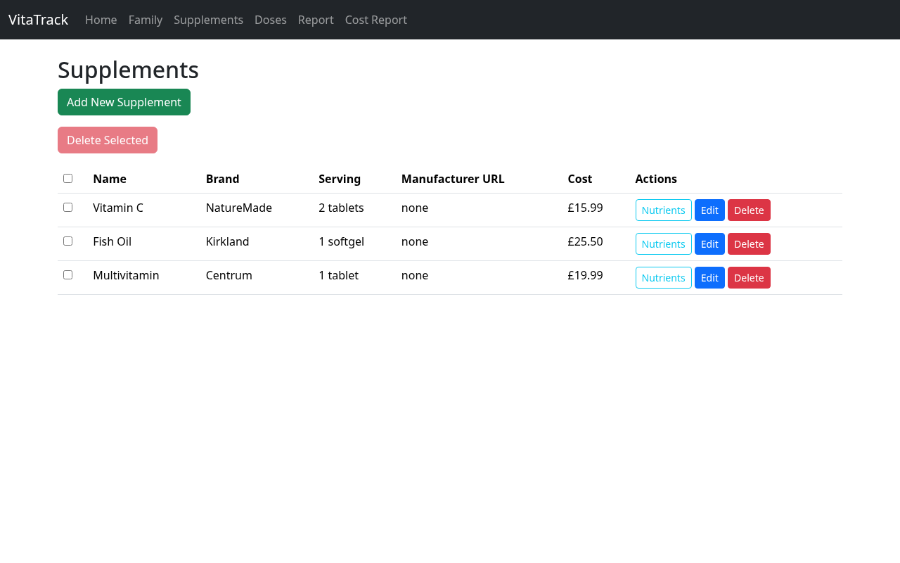
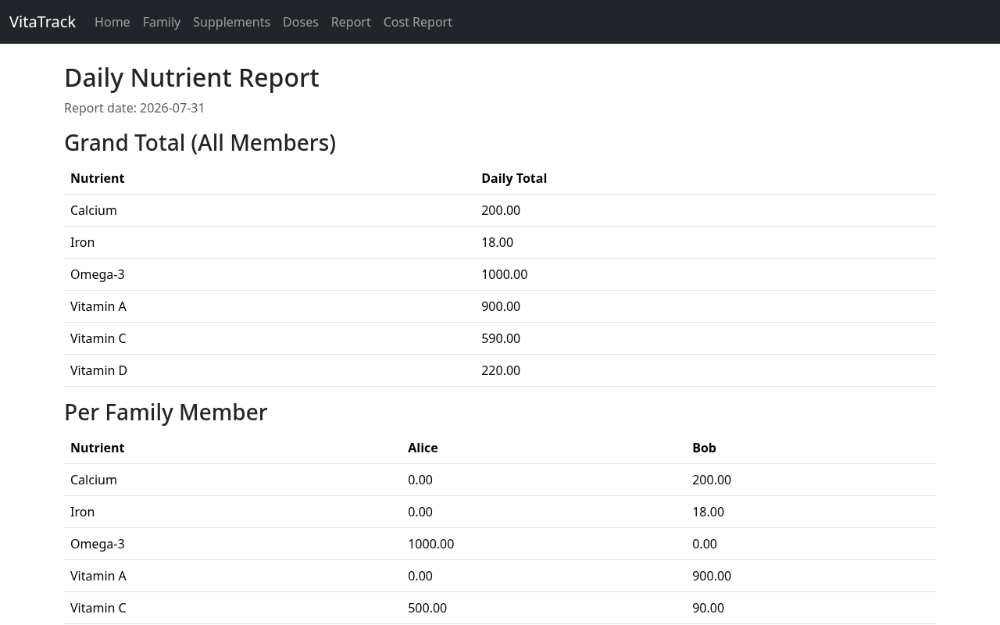
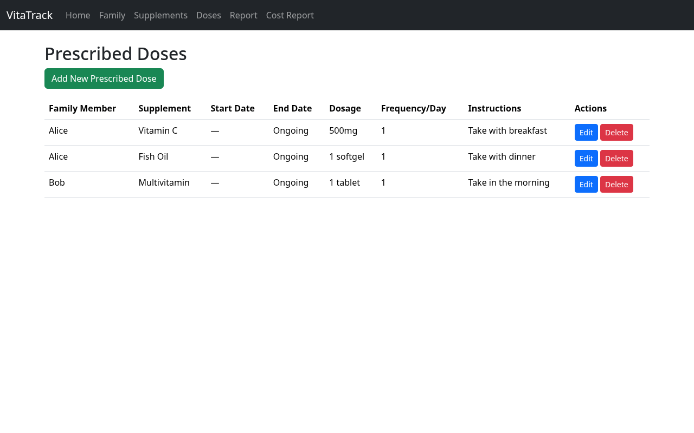

# VitaTrack

A family vitamin and supplement tracker. Track who takes what, how often, what it costs, and the actual nutrient breakdown — with optional AI-assisted extraction of nutrient labels from manufacturer product pages.

**Status: Beta.** Local-only, single-user, no authentication. Not designed for internet exposure.

## Screenshots





## Features

- **Family members** — CRUD for the people in your household
- **Supplement library** — CRUD with serving size, cost, and per-nutrient breakdown
- **AI nutrient extraction (optional)** — paste a manufacturer product URL and an LLM (via OpenRouter) parses the page into structured nutrients; you review and edit before saving
- **Prescribed doses** — assign supplements to family members with dosage, frequency, and date ranges
- **Reports** — daily nutrient totals per family member, and monthly cost breakdown by supplement and by member

## Tech stack

- ASP.NET Core MVC (.NET 10), Razor views, Bootstrap 5
- SQLite via Dapper (database file created automatically on first run)
- LLM enrichment through [OpenRouter](https://openrouter.ai) (AngleSharp for page scraping)
- Tests: MSTest (34 unit tests, in-memory SQLite + Moq) and Playwright (33 E2E tests against the real running app)

## Getting started

**Prerequisites:** .NET 10 SDK. Node.js 18+ (E2E tests only).

```bash
dotnet run --project VitaTrack.Web
# → http://localhost:5000
```

## Configuration

LLM enrichment is **optional** — the app works fully without it (you can always enter nutrients manually). To enable it, set your OpenRouter API key as an environment variable (never commit secrets):

```bash
export OpenRouter__ApiKey="sk-or-..."
dotnet run --project VitaTrack.Web
```

## Tests

```bash
dotnet test                              # unit tests
cd e2e-tests/playwright && npx playwright test   # E2E (real app, in-memory DB)
```

E2E tests spin up the real app against an isolated in-memory SQLite database.

## Security posture

This app is designed to run on **localhost only**. It has no authentication and no authorization. Do not expose it to a network or the internet. LLM enrichment sends supplement names and manufacturer page content to OpenRouter — no personal data is transmitted.

## Project structure

```
VitaTrack.Web/             # Controllers + Razor views (thin HTTP layer)
VitaTrack.Infrastructure/  # Dapper repositories, models, LLM service
VitaTrack.Tests/           # MSTest unit tests
e2e-tests/playwright/      # Playwright E2E tests
docs/screenshots/          # App screenshots used in this README
```

`AGENTS.md` documents the architecture conventions, testing philosophy, and coding standards used throughout the repo.

## A note on how this was built

This project was developed with AI-assisted pair-programming (LLM coding agents) under human direction: architecture, code review, and all final decisions are mine. The commit history and test suite reflect that process honestly.

## License

[ISC](LICENSE)
